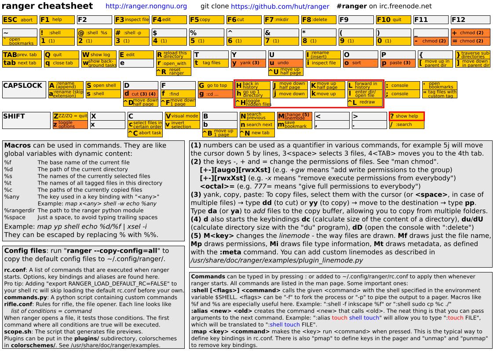

# Ranger File Manager

## Commands and Shortcuts

Offical ranger cheatsheet.

Numbers can be used as multipliers, so `5j` moves down 5 lines, `3<space>` highlights 3 lines and so on.

### General

Command | Meaning
--- | ---
Q | quit
F10 | quit
q | close tab
/ | search
j | down
k | up
l | go into directory
h | go up directory

### Renaming Files

Command | Meaning
--- | ---
cw | rename file ('change word')
A | rename file (goes to __end__ of filename)
I | rename file (goes to the __beginning__ of the file name)
a | rename file (goes right before the extension)
i | inspect a file (basically `cat`)
F3 | inspect file

### Copy, Cut, Paste

Command | Meaning
--- | ---
space | toggle highlight (select for copy, cut, etc)
yy | copy
F5 | copy
dd | cut
F6 | cut
pp | paste
po | overwrite existing file (if a file has the same name)
ud | uncut files
uy | unyank files
uv | remove all highlights
:mkdir | create new directory
F7 |  create new directory
dD | delete file
:delete | delete file
F8 | delete file
